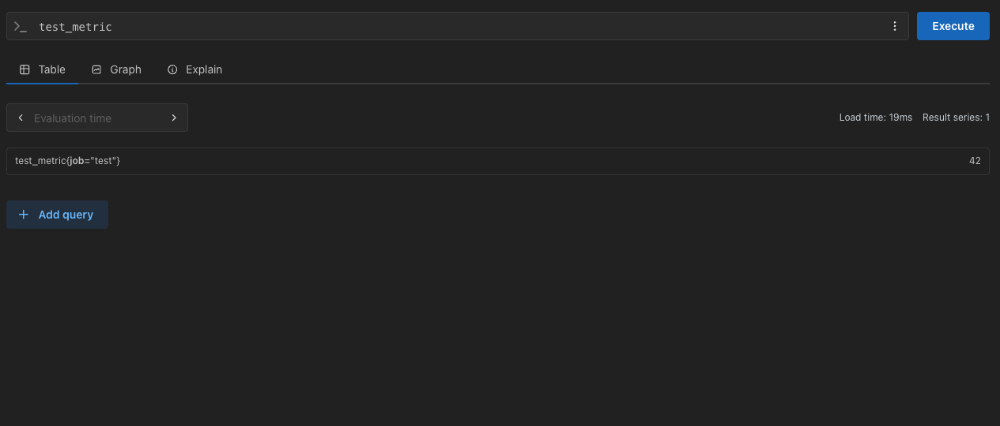
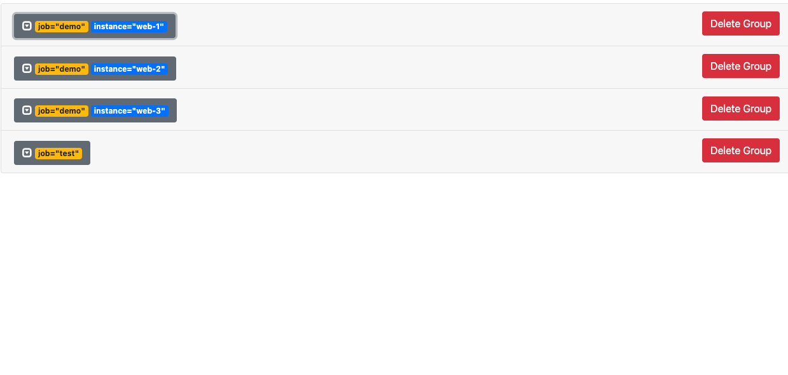
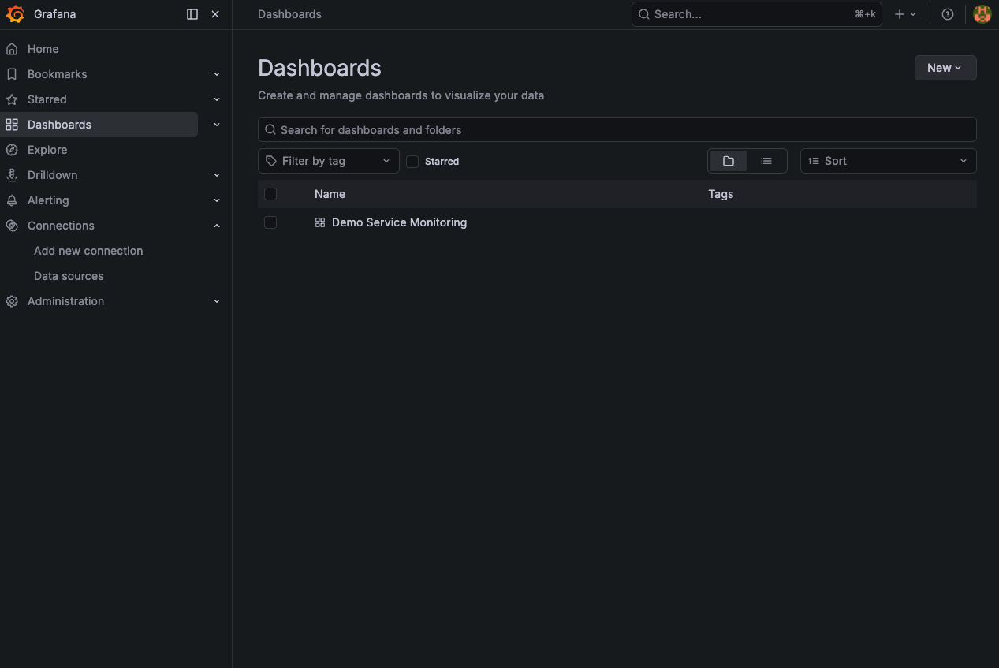
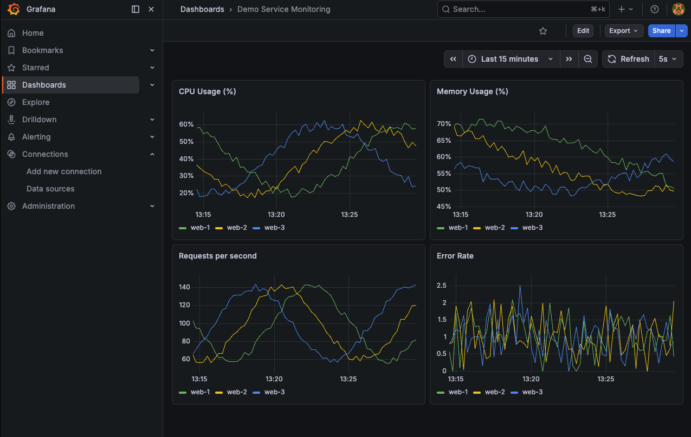
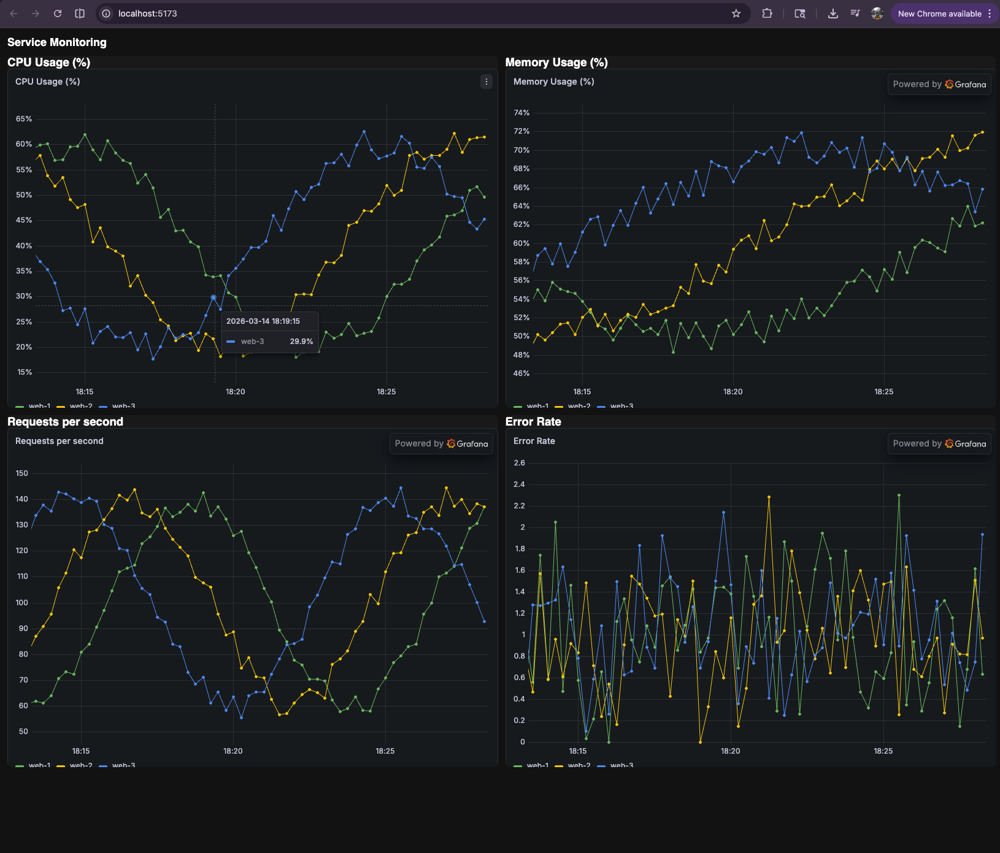

First install grafana
::: brew install grafana


Start Grafana::
brew services start grafana

will start on 3000 by default


go and
Login and shit:::


then install prometheus something Grafana will pull data from. this what grafana will send queries to.
:::: brew install prometheus


start prometheus:::
brew services start prometheus
will start on 9090 by default

Go to prometheus Status > Target and see if its up:


Now its time to connect grafana to prometheus:
Prometheus is the data provider u can uses multile data providerder like Azure data collector.

Grafana is for visualization of data, prometheus collects data.
Lets say you wanna monitor a server like how much memory is occupied.
Prometheus retreives the data by examining the target(server here) and stores them in a time series. 
Grafana can ask prometheus for that data and then show it to you in a graph from showing time to memory like a graph. So Garafana visualizes and prometheus collects data. 


Right now prometheus is just scraping itself it doen't have data to visualize for garfana.


For this example we will connect grafana to prometheus

Steps::
- Go to http://localhost:3000 (Garafana)
- Click Connections → Data sources in the left sidebar
- Click Add new data source
- Select Prometheus
- Set the URL to http://localhost:9090 (Prometheus URL)
- Scroll down and click Save & test


Now lets install pushgateway

because u can push data into prometheus it's a scraper it reads data from a service.

we will push data into pushgateway and prometheus reads data from pushgateway and then grafana will have data to read from prometheus.


curl -LO https://github.com/prometheus/pushgateway/releases/download/v1.8.0/pushgateway-1.8.0.darwin-arm64.tar.gz
tar -xzf pushgateway-1.8.0.darwin-arm64.tar.gz
cd pushgateway-1.8.0.darwin-arm64
./pushgateway &


push gateway will start on. http://localhost:9091/

Pushgateway is up and running on port 9091.
Now we need to tell Prometheus to scrape it. We need to edit the Prometheus config file:

edit this file: nano /opt/homebrew/etc/prometheus.yml


add a new scraping job:

- job_name: "pushgateway"
    honor_labels: true
    static_configs:
      - targets: ["localhost:9091"]

save it and then restart prometheus:

brew services restart prometheus


check in the prometheus website to see the new targets:


To push metrics from Python to the Pushgateway. The prometheus-client library is what lets a Python script speak Prometheus' format and POST to the Pushgateway.
Without it we'd have to manually craft the HTTP requests ourselves. 


pip3 install prometheus-client


Now look at the example how we push to pushgateway using prometheus-client
at pushgateway/test_push.py

Now go to pushgateway website:

You can see test_metric with value 42 — exactly what we pushed. The full pipeline works:
`Python script → Pushgateway → Prometheus → (Grafana next)`
The other two metrics (push_time_seconds and push_failure_time_seconds) are automatically added by Pushgateway itself — they just track when the last push happened and whether it succeeded. 

Go to http://localhost:9090 and click Query in the top nav:
`test_metric`




now go to pushgateway/metric_generator.py

go to pushgateway website after running the script



Now let's write the dashboard injection script. 
we'll create inject_dashboard.py and push a real dashboard into Grafana via the API.


Now go to grafana/inject_dashboard:

run it:
```bash
(base) sunami@Sunamis-MacBook-Pro grafana % python3 inject_dashboard.py                  
200 {'folderUid': '', 'id': 1632689761652736, 'slug': 'demo-service-monitoring', 'status': 'success', 'uid': 'demo-monitoring-01', 'url': '/d/demo-monitoring-01/demo-service-monitoring', 'version': 1}
```





:::: Inorder to use iframes:  We need to enable anonymous access in Grafana so the iframes load without a login.


edit:::
nano /opt/homebrew/etc/grafana/grafana.ini

[auth.anonymous]
enabled = true
org_role = Viewer

for help to find it:: 
(base) sunami@Sunamis-MacBook-Pro Graphana % grep -n "auth.anonymous" /opt/homebrew/etc/grafana/grafana.ini
683:[auth.anonymous]

nano +683 /opt/homebrew/etc/grafana/grafana.ini

restart after that
brew services restart grafana


if it doesn't work :

check this setting:

 The panels are blocked because Grafana has X-Frame-Options: deny by default. We need to allow iframes in the Grafana config.


grep -n "allow_embedding" /opt/homebrew/etc/grafana/grafana.ini

if u see this:
(base) sunami@Sunamis-MacBook-Pro Graphana % grep -n "allow_embedding" /opt/homebrew/etc/grafana/grafana.ini
406:;allow_embedding = false
(base) sunami@Sunamis-MacBook-Pro Graphana % 

chnage to true:

and restart again

this is how iframes look:


